# DATADOC: Master Planning Board

> **Tagline:** "The Open Source Operating System for Dataset Engineering."

Welcome to the DATADOC Master Planning Workspace. This document serves as the single source of truth for the entire project's architecture, design decisions, and implementation strategies before any code is written.

---

## 🎨 Board 1: Project Vision

DATADOC is an intelligent, modular Dataset Engineering Framework that orchestrates existing powerful libraries (Pandas, Polars, Scikit-learn, Featuretools) into a standardized, reusable workflow.

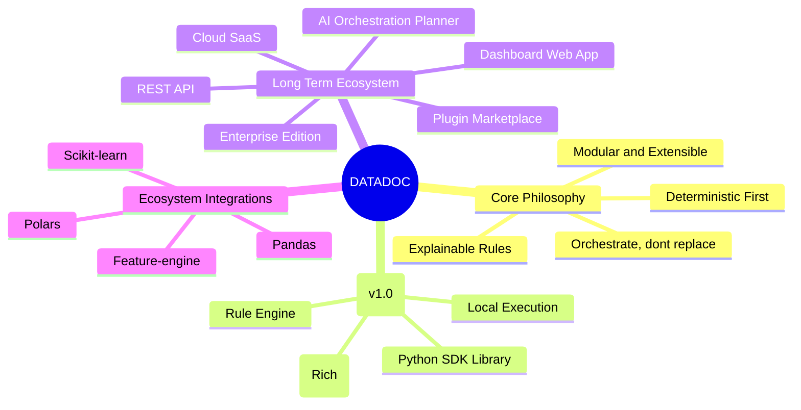

---

## 🏛️ Board 2: System Architecture

The architecture is strictly separated into layers. The business logic lives exclusively in the **Core Engine**.

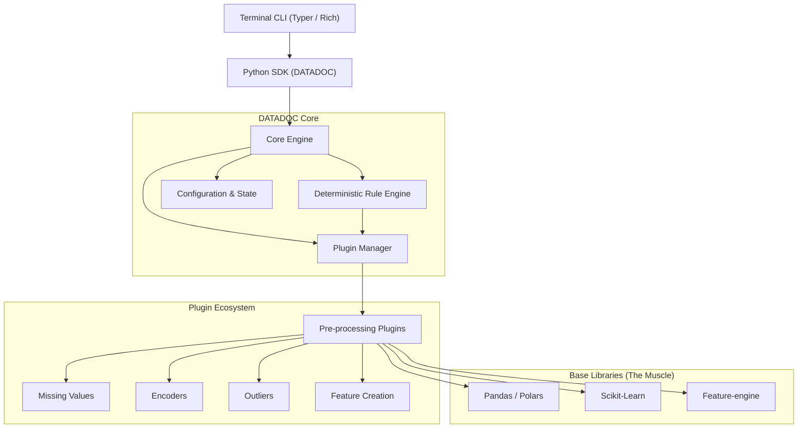

> [!TIP]
> **Design Decision:** The CLI interacts with the Python SDK, not the Core Engine directly. This ensures the SDK is robust and capable of everything the CLI can do.

---

## 📁 Board 3: Project Structure

An enterprise-grade repository structure designed for modularity and open-source contribution.

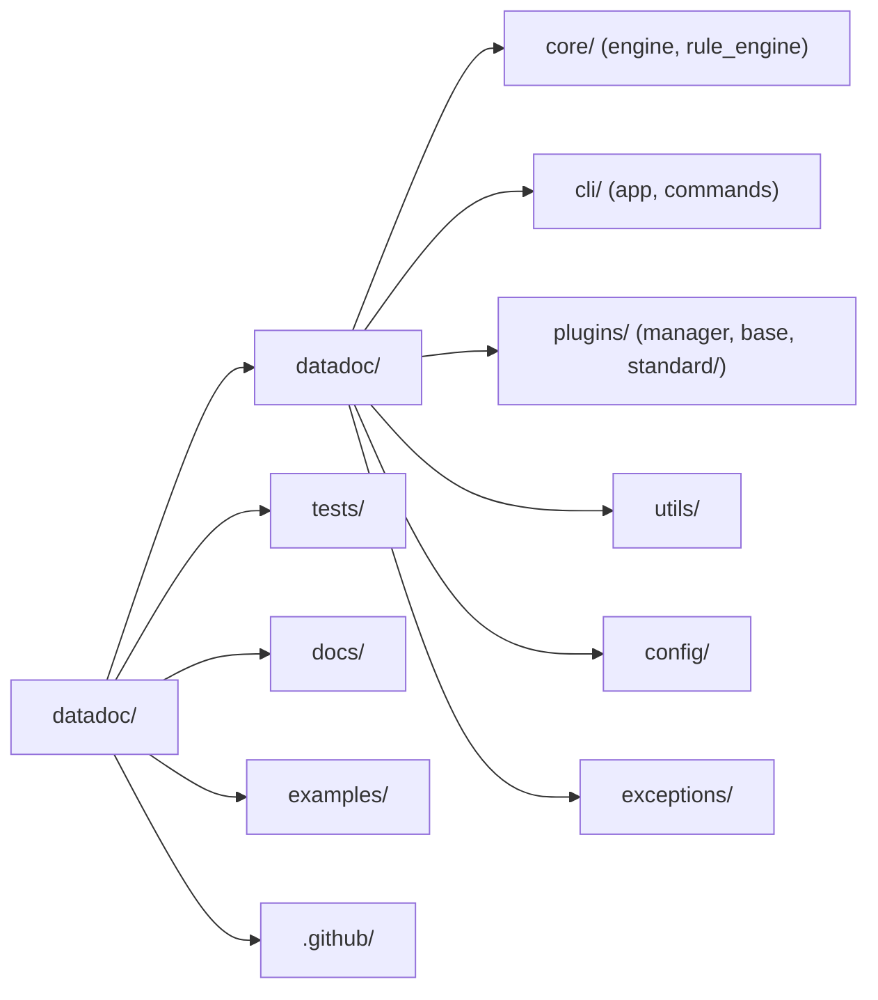

---

## 🔌 Board 4: Plugin Architecture

Every preprocessing operation is an isolated plugin inheriting from a strict base class.

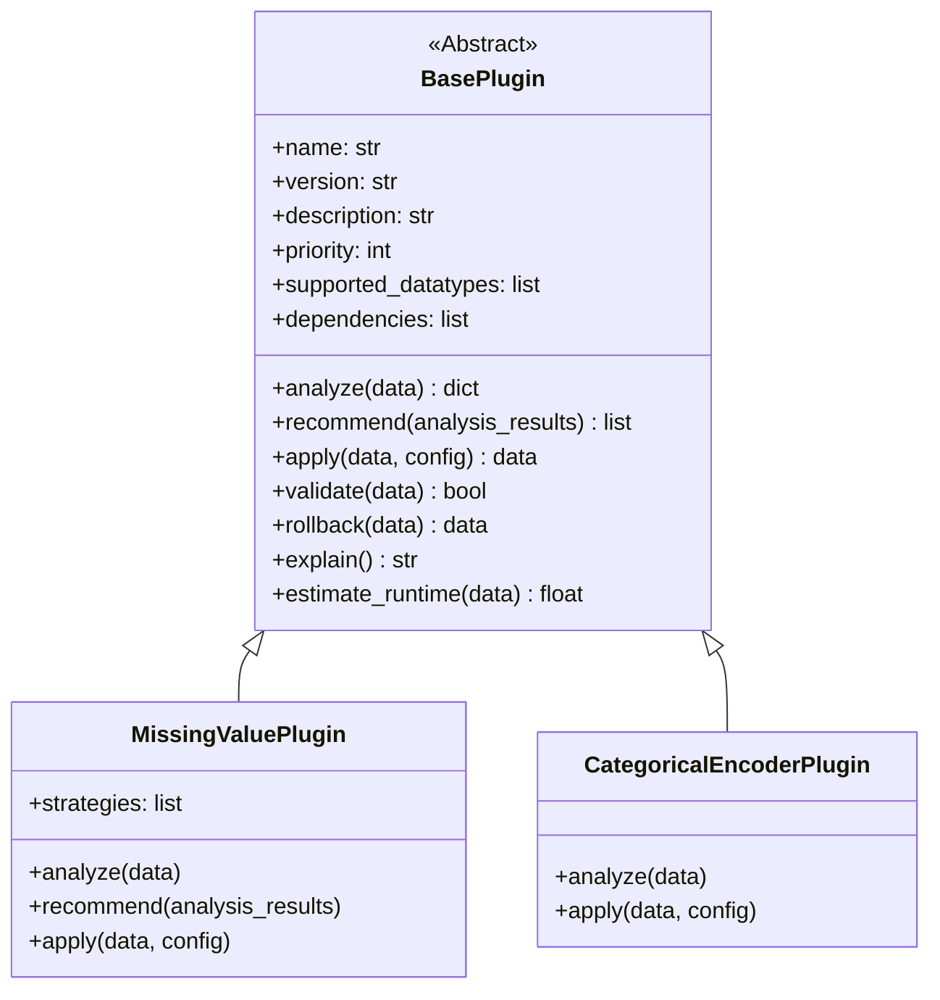

> [!IMPORTANT]
> **Design Decision:** Plugins MUST implement `rollback()` and `explain()`. Explainability is a core pillar. We must be able to tell the user *why* an operation occurred and revert it if needed.

---

## ⚙️ Board 5: Feature Engineering (Rule Engine)

Version 1 uses a Deterministic Rule Engine to orchestrate plugins based on hardcoded best practices.

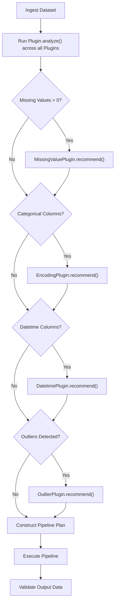

---

## 💻 Board 6: CLI Design

The CLI uses modern tools (e.g., Typer and Rich) for a beautiful, colorful, and highly readable terminal experience.

| Command | Description |
|---|---|
| `datadoc analyze` | Scans dataset, returns rich health report table |
| `datadoc recommend`| Outputs a list of suggested engineering steps |
| `datadoc engineer` | Automatically applies the best-practice pipeline |
| `datadoc compare` | Diff-like view between raw and engineered datasets |
| `datadoc pipeline` | Exports the generated pipeline as a standalone `.py` script |
| `datadoc report` | Generates a visual HTML/Markdown report |
| `datadoc plugin` | Lists, enables, or disables local plugins |

---

## 🐍 Board 7: Python SDK Interface

The SDK must feel elegant, chained, and highly intuitive.

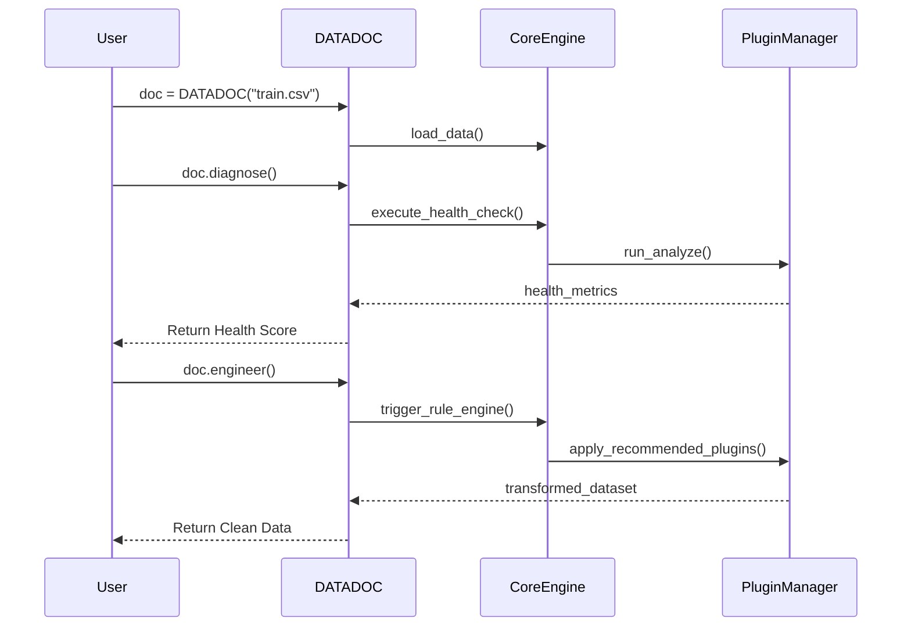

---

## 🔄 Board 8: Core Workflow

The end-to-end lifecycle of a dataset passing through DATADOC.

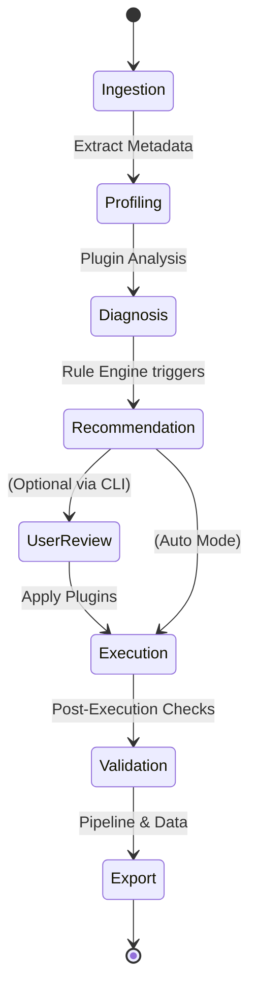

---

## 🗺️ Board 9: Roadmap (Milestones)

| Milestone | Objectives | Estimated Time | Deliverables |
|---|---|---|---|
| **M1: Foundation** | Core Engine, Base Plugin Class, CLI skeleton | 2 Weeks | `datadoc` core package, CLI entrypoint |
| **M2: Profiler** | `analyze()`, `diagnose()` logic, Rich CLI tables | 2 Weeks | Health score, terminal analysis reports |
| **M3: Rule Engine** | Deterministic engine, Missing Value/Encoder plugins | 3 Weeks | First end-to-end automated `engineer()` workflow |
| **M4: Adv Features** | Outliers, Datetimes, Scaling, Pipeline Export | 3 Weeks | Exportable `.py` pipelines, expanded plugins |
| **M5: V1.0 Polish** | Docs, benchmarks, test coverage, release | 2 Weeks | PyPI Release, ReadTheDocs, GitHub Actions |

---

## 🐙 Board 10: GitHub & Open Source Strategy

- **Branching Strategy:** GitHub Flow (main is always deployable, feature branches for work).
- **Semantic Versioning:** Strict SemVer (`MAJOR.MINOR.PATCH`).
- **Issues & PRs:** Enforced templates (Bug Report, Feature Request, Plugin Proposal).
- **CI/CD Actions:**
  - `lint.yml` (Ruff, MyPy)
  - `test.yml` (Pytest matrix across Python 3.9 - 3.12, OS matrix)
  - `publish.yml` (Auto-publish to PyPI on GitHub Release)
- **Community:** 
  - `CONTRIBUTING.md` with explicit instructions on "How to build a Plugin".
  - Labels: `good first issue`, `plugin-idea`, `core-engine`.

---

## 🧪 Board 11: Testing Strategy

Every step is independently testable. AI should not be involved in the determinism of tests.

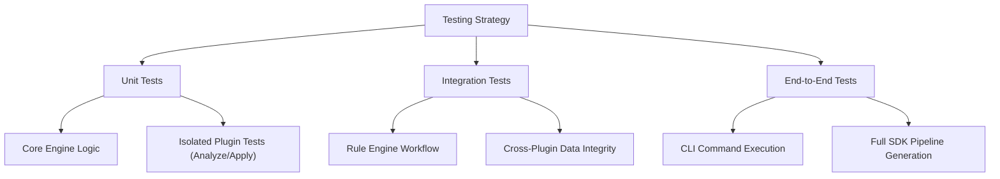

---

## 🚀 Board 12: Future Roadmap (Ecosystem)

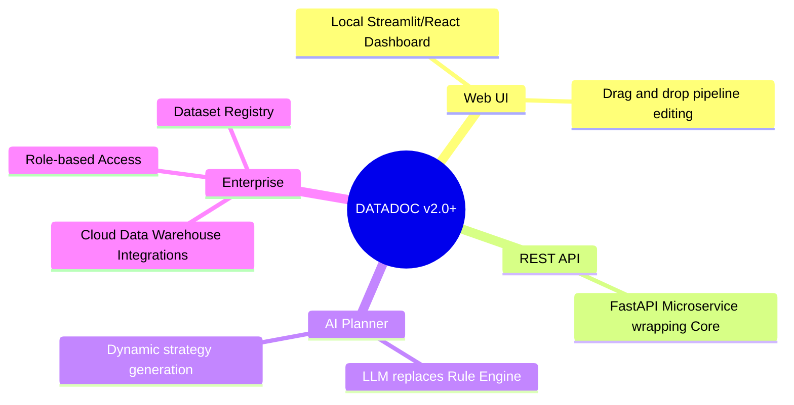

---

## 🛒 Board 13: Plugin Marketplace Architecture

In future versions, plugins are decoupled from the core repository.

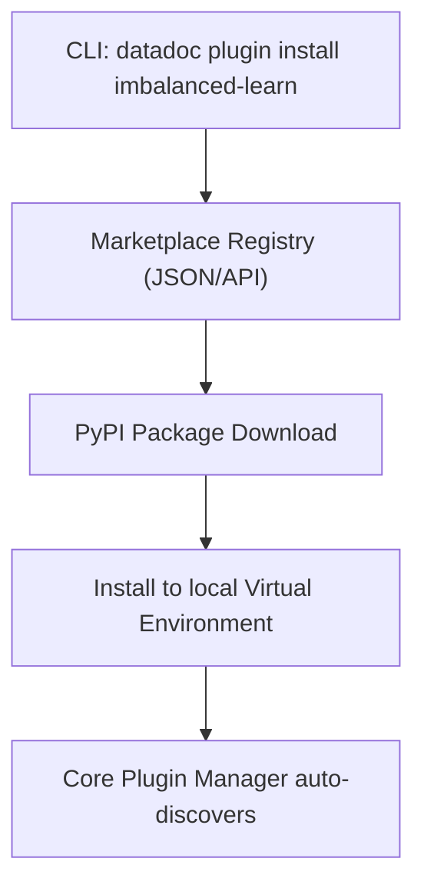

> [!NOTE]
> **Design Decision:** The marketplace will act as a curated index pointing to PyPI packages prefixed with `datadoc-plugin-`. This leverages existing Python infrastructure (pip/uv).

---

## 🧠 Board 14: AI Planner (Future Vision)

When the project matures, the deterministic rule engine is swapped for an LLM planner, **but the plugins remain unchanged**.

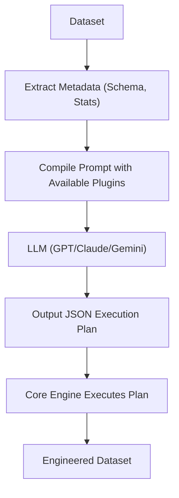

---

## 🪜 Board 15: Implementation Sequence

> **Crucial Rule:** Never build everything at once. Build sequentially, ensuring a working, testable product at each step.

1. **Step 1: The Skeleton** 
   - Set up `pyproject.toml`, Ruff, Pytest.
   - Create `DATADOC` base class (no logic, just loading data into Pandas).
2. **Step 2: Plugin Architecture Foundation**
   - Create `BasePlugin` abstract class.
   - Create `PluginManager` that registers a dummy plugin.
3. **Step 3: CLI Scaffolding**
   - Implement `Typer` app with a dummy `analyze` command that prints "Hello from DATADOC".
4. **Step 4: The Profiler & Health Metrics**
   - Implement basic `analyze()` in the Core. Calculate missing value %, data types.
   - Connect CLI to print Rich tables.
5. **Step 5: The First Real Plugin**
   - Implement `MissingValuePlugin` (Mean/Median imputation).
6. **Step 6: The Rule Engine V1**
   - Implement basic IF statements in Core to trigger `MissingValuePlugin` if missing values are found.
7. **Step 7: The "Fix" Workflow**
   - Wire SDK `doc.fix()` to execute the Rule Engine. 
   - Wire CLI `datadoc fix` to output the result.
8. **Step 8: Expanding the Arsenal (Parallelizable)**
   - Add `CategoricalEncoderPlugin`.
   - Add `OutlierPlugin`.
9. **Step 9: Pipeline Generation**
   - Implement logic to record plugin actions and export them to a `.py` file (`datadoc pipeline`).
10. **Step 10: Polish & Release v0.1.0**
    - Documentation, examples, and CI/CD pipelines.

---
*End of Master Planning Board.*
